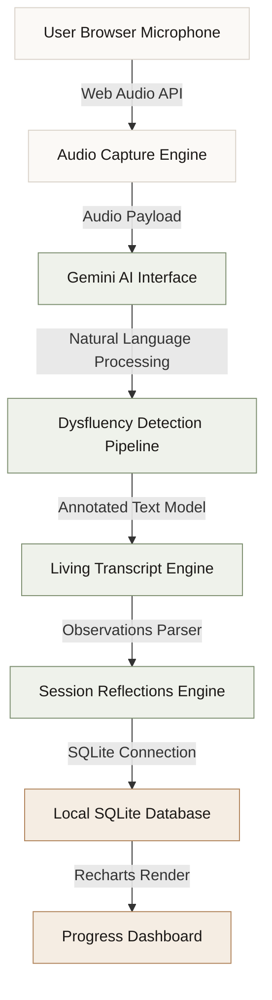

# VoiceScribe

**A thoughtful speech space centering the dignity of human speech.**

VoiceScribe is an AI-powered speech fluency coach that helps people who stutter practice speaking in a private, browser-based environment. Evolving past cold startup metrics and clinical dashboards, VoiceScribe approaches dysfluency not as a bug to be fixed, but as an aspect of speech to be understood, visualised, and respected. Through browser-native audio capture, typography-first transcription, and Gemini-powered analysis, VoiceScribe offers a gentle, private sanctuary for voice training.

---

<div align="left">
  
  
  
  
  
  
  
</div>

---

## Table of Contents

- [Why VoiceScribe Exists](#why-voicescribe-exists)
- [Features](#features)
- [Product Experience](#product-experience)
- [Screenshots](#screenshots)
- [Architecture](#architecture)
- [Technology Stack](#technology-stack)
- [Accessibility First](#accessibility-first)
- [Design Philosophy](#design-philosophy)
- [Local Development](#local-development)
- [Future Roadmap](#future-roadmap)
- [Team](#team)
- [License](#license)

---

## Why VoiceScribe Exists

Stuttering affects over 80 million people globally, representing a profound human challenge. In a fast-paced digital world, individuals who experience repetitions, prolongations, blocks, or long pauses frequently encounter communication fatigue, digital exclusion, and social anxiety. 

Traditional speech therapy is incredibly valuable but often inaccessible due to cost, geography, or scheduling. Meanwhile, existing speech tools fall short because they adopt a rigid "error-correction" model: they flag stuttered words like spelling mistakes, using jarring red warnings or scoring scales that treat dysfluency as a system failure. This clinical detachment can undermine confidence.

VoiceScribe was created to offer an alternative: a **private, browser-native sanctuary**. By visualising speech as a fluid, artistic medium rather than a set of errors, VoiceScribe allows users to practice independently, view their dysfluencies mapped in beautiful, non-judgmental editorial typography, and develop self-reflection at their own pace.

---

## Features

VoiceScribe is built as a highly responsive, single-workspace application that is completely free of dashboard clutter:

*   **Browser Microphone Recording** — Zero setups, zero extensions. Captures raw audio locally through the browser API in a quiet, breathing interface that encourages steady breathing and calm.
*   **AI-Powered Transcription** — Seamlessly converts speech to text, allowing you to review your exact phrasing and patterns.
*   **Dysfluency Detection Pipeline** — Elegant server-side integration that analyzes text patterns to capture:
    *   *Repetitions* (words or phrases repeated back-to-back)
    *   *Prolongations* (drawn-out syllables)
    *   *Blocks* (silent pauses before a word starts)
    *   *Filler Words* ("um", "like", "ah")
    *   *Long Pauses* (breathing gaps)
*   **The Living Transcript** — Speech visualised with dignity. Dysfluencies are represented typographically (e.g. copper double underlines for repetitions, spaced italic letters for prolongations, and clean bracket markers for blocks) instead of red warning badges.
*   **Reflective Session Summaries** — A written editorial recap summarizing what went well and areas to explore, moving away from gamified SaaS checkmarks.
*   **Progress Analytics** — Custom charts displaying long-term fluency trends, utilizing a warm, print-style layout.
*   **Privacy-First Architecture** — Session data is recorded and processed using local databases, keeping your voice files and history secure.

---

## Product Experience

```
┌─────────────────┐      ┌─────────────────┐      ┌─────────────────┐
│  1. Open Space  │ ───> │ 2. Speak Freely │ ───> │ 3. See Analysis │
└─────────────────┘      └─────────────────┘      └─────────────────┘
         ▲                                                 │
         │                                                 ▼
┌─────────────────┐                               ┌─────────────────┐
│ 5. Track Growth │ <──────────────────────────── │ 4. Reflect &    │
└─────────────────┘                               │    Read Summary │
                                                  └─────────────────┘
```

1.  **Open VoiceScribe** — Enter a quiet, warm paper workspace designed to lower heart rates and remove distractions.
2.  **Speak Freely** — Click "Start Practice" and begin speaking into your microphone. A subtle breathing animation visualises your rhythm.
3.  **Receive Live Analysis** — Your speech populates the screen instantly, with dysfluencies gracefully highlighted via typographic annotations.
4.  **Review the Living Transcript** — Read your speech mapped onto the screen, coupled with clinical-warmth observations and paragraph-style insights.
5.  **Track Progress Over Time** — Visit your journey log to see fluency charts, reflecting on consistent practice without pressure.

---

## Screenshots

### Landing Experience

*A minimalist, editorial landing page introducing VoiceScribe's core vision, and featuring the brand mascot and a clean call to action.*

### Practice Studio

*The workspace layout with less side margin space, prioritizing the recording interface, live transcript, and observation charts.*

---

## Architecture



---

## Technology Stack

| Technology | Purpose | Implementation Detail |
|---|---|---|
| **Next.js 15** | Framework | Handles client-side workspace views, server-side API endpoints, and optimized page routing. |
| **TypeScript** | Language | Enforces strict static typing across database schemas, API requests, and UI parameters. |
| **Tailwind CSS** | Styling | Drives the editorial design system using custom HSL values (`#F6F1EB`, `#1C1917`, `#B0845B`). |
| **Gemini 2.5 Flash** | AI Engine | Analyzes transcribed audio text to identify filler words, repetitive structures, and speech patterns. |
| **SQLite & Drizzle** | Storage | Provides local relational schema storage for sessions, statistics, and events. |
| **Recharts** | Visuals | Powers the custom timeline charts, styled to resemble high-end print infographics. |

---

## Accessibility First

VoiceScribe was built from the ground up to respect the psychological and physical realities of speech dysfluency:

> [!NOTE]
> **Dignity-First Design**
> We reject the idea that stuttering is a failure of communication. Speech blocks, repetitions, and prolongations are simply different rhythms of human expression. The interface displays them with visual beauty, allowing users to understand their speech patterns without feeling judged.

*   **No Time Pressure** — Recording interfaces do not force limits, countdowns, or sudden cut-offs.
*   **Gentle Success States** — Visual rewards do not require "perfect 100%" scores. Success is defined as the act of practicing and reflecting, not achieving standard fluency.
*   **Contrast & Legibility** — Designed with heavy display and sans-serif weights to ensure text is visible even in low-light environments, without causing visual fatigue.
*   **Privacy-Native** — No audio or transcript leaves your machine without your consent, keeping the workspace secure for vulnerable practicing.

---

## Design Philosophy

VoiceScribe represents an aesthetic pivot away from the neon gradients, glassmorphism, and card-heavy layouts of modern SaaS tools:

*   **"Clinical Warmth meets Literary Editorial Design"** — Drawing inspiration from Aesop, The New York Times Magazine, and classic print newspapers, the interface uses a warm paper color palette (`#F6F1EB`), deep charcoal inks, and soft copper underlines.
*   **Typographical Hierarchy** — High-end Cormorant Garamond is used for headlines, IBM Plex Sans for reading copy, and IBM Plex Mono for statistics and timeline coordinates.
*   **Subtle Motion** — Only quiet, rhythmic breathing animations are used to lower anxiety levels, avoiding high-contrast flashing lights.

---

## Local Development

Follow these steps to get VoiceScribe running locally on your computer:

### 1. Prerequisites
- Node.js (version 18 or higher)
- npm or yarn

### 2. Clone and Setup
```bash
# Clone the repository
git clone https://github.com/arj-co/VoiceScribe.git
cd VoiceScribe

# Install dependencies
npm install
```

### 3. Environment Configuration
Create a `.env.local` file in the root directory:
```bash
touch .env.local
```

Populate `.env.local` with the following variables:
```env
# Gemini API Key (get yours at https://aistudio.google.com/)
GEMINI_API_KEY=your_gemini_api_key_here

# Local SQLite Database Path
DATABASE_URL=file:./data/voicescribe.db
```

### 4. Running the App
```bash
# Start the local development server
npm run dev
```

Open [http://localhost:3000](http://localhost:3000) in your browser to experience VoiceScribe.

---

## Future Roadmap

- [ ] **Real-Time Streaming** — Provide continuous, live transcription updates as you speak.
- [ ] **Therapist Portal** — Add support for sharing progress reports securely with speech-language therapists.
- [ ] **Personalized Focus Plans** — Offer curated exercise tracks depending on dysfluency type.
- [ ] **Mobile Support** — Introduce responsive viewports for speech practice on smartphones.
- [ ] **Comparative Analytics** — Track how phrasing modifications impact speech speed and blocks over multiple sessions.

---

## Team

- **Arjun Anil Shewalkar** — Lead Engineer & Product Designer

---

## License

This project is licensed under the terms of the license file located in [LICENSE.txt](file:///Users/arjun/VoiceScribe/LICENSE.txt).
