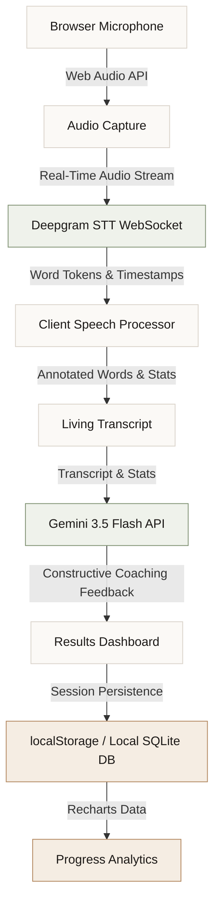

# VoiceScribe

**A real-time speech coaching tool for anyone who wants to speak with more confidence.**

VoiceScribe is a browser-based speech practice environment. Through browser-native audio capture, typography-first transcription, and Gemini-powered analysis, it offers a private, low-pressure space for improving how you speak — whether you're preparing for an interview, a presentation, or working on everyday fluency.

---

<div align="left">
  
  
  
  
  
  
  
  
  
</div>

---

## Table of Contents

- [Overview](#overview)
- [Features](#features)
- [Product Experience](#product-experience)
- [Architecture](#architecture)
- [Technology Stack](#technology-stack)
- [Design Philosophy](#design-philosophy)
- [Local Development](#local-development)
- [Future Roadmap](#future-roadmap)
- [Team](#team)
- [License](#license)

---

## Overview

VoiceScribe was built for anyone who wants to speak more clearly and confidently. It runs entirely in the browser, keeping your audio and session data local. There are no accounts, no servers receiving your voice, and no gamified pressure — just a quiet space to practice and reflect.

---

## Features

- **Browser Microphone Recording** — Zero setup, zero extensions. Audio is captured locally via the Web Audio API.
- **Real-Time Speech-to-Text** — Streams microphone audio to **Deepgram** over WebSockets for instant, low-latency transcription.
- **Client-Side Speech Processor** — Runs specialized heuristic rules in real-time to analyze and classify speech patterns:
  - *Repetitions* — words or phrases repeated back-to-back (or with one intervening word)
  - *Prolongations* — words with drawn-out syllables (exceeding 2.5x average duration)
  - *Blocks* — silent pauses preceding a word start
  - *Filler Words* — detects "um", "uh", "like", "so", etc., using a customized word processor
  - *Long Pauses* — silent breathing gaps (>1.5 seconds) dynamically inserted as pause events
- **The Living Transcript** — Dysfluencies rendered typographically (copper underlines for repetitions, dotted green underlines for prolongations, dot prefixes for blocks, and hairline underlines for pauses) rather than anxiety-inducing warning badges.
- **AI-Powered Speech Coaching** — Serverless client-to-API integration with **Gemini 3.5 Flash** for tough-love coaching feedback, coverage analytics, actionable drills, and score re-evaluation.
- **Progress Analytics** — Long-term fluency trend charts built with **Recharts**, styled to resemble print infographics.
- **Dark Mode** — Full light/dark theme support via `next-themes`.
- **Privacy-First Storage** — Practice sessions are kept local, persisted in the browser's `localStorage` and supported by a local **SQLite database** using `better-sqlite3`.

---

## Product Experience

```
┌─────────────────┐      ┌─────────────────┐      ┌─────────────────┐
│  1. Open Space  │ ───> │ 2. Speak Freely │ ───> │ 3. See Analysis │
└─────────────────┘      └─────────────────┘      └─────────────────┘
         ▲                                                 │
         │                                                 ▼
┌─────────────────┐                               ┌─────────────────┐
│ 5. Track Growth │ <──────────────────────────── │ 4. Read Summary │
└─────────────────┘                               └─────────────────┘
```

1. **Open VoiceScribe** — Enter a warm, distraction-free workspace.
2. **Speak Freely** — Click "Start Practice" and speak into your microphone.
3. **Receive Analysis** — Your speech is transcribed and annotated with typographic markers.
4. **Read the Summary** — Get a paragraph-style reflection on your session.
5. **Track Progress** — Review fluency charts across sessions.

---

## Architecture



---

## Technology Stack

| Technology | Version | Purpose |
|---|---|---|
| **Next.js** | 16.2.9 | App framework — App Router, API routes, server components |
| **React** | 19.2.4 | UI rendering |
| **TypeScript** | 5.x | Static typing across the full stack |
| **Tailwind CSS** | 4.x | Styling via the new CSS-first config (`@tailwindcss/postcss`) |
| **Framer Motion** | 12.40.0 | Page and component animations — transitions, word reveals, fade-ins |
| **Deepgram API** | — | Real-time speech-to-text transcription via WebSockets |
| **Gemini 3.5 Flash** | — | Structured speech coaching, reflection generation, and score re-evaluation |
| **better-sqlite3** | 12.10.0 | Synchronous local SQLite database for session and progress storage |
| **Recharts** | 3.8.1 | Fluency trend charts and session analytics |
| **next-themes** | 0.4.6 | Light/dark mode management |
| **lucide-react** | 1.17.0 | Icon set |
| **clsx + tailwind-merge** | — | Conditional class name composition |
| **class-variance-authority** | 0.7.1 | Variant-based component styling |

### Fonts (Google Fonts)
| Font | Usage |
|---|---|
| **Montserrat** | Display headings (`font-display`) and clean branding elements (`font-sans`) |
| **IBM Plex Sans** | Primary editorial body copy (`font-body`) |
| **IBM Plex Mono** | Labels, speech stats, tables, timestamps (`font-mono`) |

---

## Design Philosophy

VoiceScribe draws from literary editorial design — Aesop, The New York Times Magazine, classic print newspapers — rather than standard SaaS UI patterns.

- **Color palette** — Warm paper (`#F5F3EE`), rich near-black ink (`#1C1E1A`), primary sage green (`#3E8B5C`), and supporting copper (`#A0703E`).
- **Typography-first** — Speech patterns are communicated through typographic annotation (dotted and dashed underlines, inline elements), not warning badges or scores.
- **Subtle motion** — Quiet, rhythmic animations (breathing glows, gentle pulses) that reduce anxiety rather than demand attention.
- **No time pressure** — No countdowns, forced limits, or gamified scoring.

---

## Local Development

### Prerequisites

- Node.js 18+
- npm

### Setup

```bash
# Clone the repository
git clone https://github.com/arj-co/VoiceScribe.git
cd VoiceScribe

# Install dependencies
npm install
```

### Environment

Create a `.env.local` file in the project root:

```env
# Gemini AI (speech analysis) — get yours at https://aistudio.google.com/
NEXT_PUBLIC_GEMINI_API_KEY=your_gemini_api_key_here
GEMINI_MODEL=gemini-3.5-flash

# Deepgram (real-time speech-to-text) — get yours at https://console.deepgram.com/
NEXT_PUBLIC_DEEPGRAM_API_KEY=your_deepgram_api_key_here

# Local SQLite database path
DATABASE_PATH=./data/voicescribe.db
```

### Run

```bash
npm run dev
```

Open [http://localhost:3000](http://localhost:3000) in your browser.

---

## Future Roadmap

- [ ] **Real-Time Streaming** — Continuous live transcription as you speak.
- [ ] **Personalized Focus Plans** — Curated exercise tracks based on speech patterns.
- [ ] **Mobile Support** — Responsive viewports for practice on smartphones.
- [ ] **Comparative Analytics** — Track how specific phrasing changes affect fluency over time.
- [ ] **Export** — Download session transcripts and summaries as PDF or Markdown.

---

## Team

- **Arjun S** — Lead Engineer & Product Designer
- **Neytiri C** — Research & Product Lead

---

## License

This project is licensed under the terms of the license file located in [LICENSE.txt](./LICENSE.txt).
