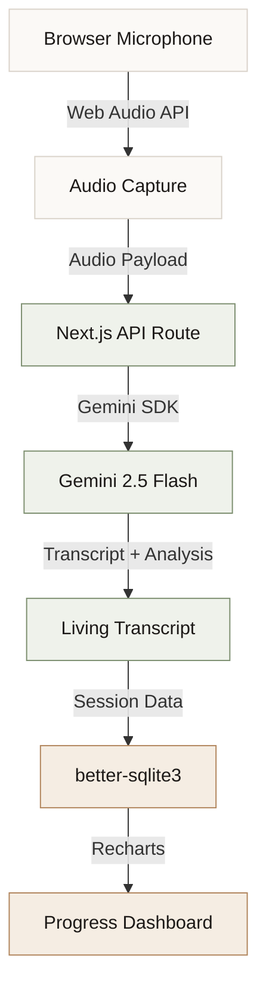

# VoiceScribe

**A real-time speech coaching tool for anyone who wants to speak with more confidence.**

VoiceScribe is a browser-based speech practice environment. Through browser-native audio capture, typography-first transcription, and Gemini-powered analysis, it offers a private, low-pressure space for improving how you speak — whether you're preparing for an interview, a presentation, or working on everyday fluency.

---

<div align="left">
  
  
  
  
  
  
  
  
</div>

---

## Table of Contents

- [Overview](#overview)
- [Features](#features)
- [Product Experience](#product-experience)
- [Architecture](#architecture)
- [Technology Stack](#technology-stack)
- [Design Philosophy](#design-philosophy)
- [Local Development](#local-development)
- [Future Roadmap](#future-roadmap)
- [Team](#team)
- [License](#license)

---

## Overview

VoiceScribe was built for anyone who wants to speak more clearly and confidently. It runs entirely in the browser, keeping your audio and session data local. There are no accounts, no servers receiving your voice, and no gamified pressure — just a quiet space to practice and reflect.

---

## Features

- **Browser Microphone Recording** — Zero setup, zero extensions. Audio is captured locally via the Web Audio API.
- **AI-Powered Transcription** — Converts speech to text using Gemini, letting you review phrasing and patterns.
- **Speech Analysis Pipeline** — Server-side Gemini integration detects:
  - *Repetitions* — words or phrases repeated back-to-back
  - *Prolongations* — drawn-out syllables
  - *Blocks* — silent pauses before a word starts
  - *Filler Words* — "um", "like", "ah"
  - *Long Pauses* — significant breathing gaps
- **The Living Transcript** — Dysfluencies rendered typographically (copper underlines for repetitions, dotted underlines for prolongations, bullet prefixes for blocks) rather than warning badges.
- **Reflective Session Summaries** — A written editorial recap of each session, generated by Gemini.
- **Progress Analytics** — Long-term fluency trend charts built with Recharts, styled to resemble print infographics.
- **Dark Mode** — Full light/dark theme support via `next-themes`.
- **Privacy-First** — All session data is stored in a local SQLite database via `better-sqlite3`. Nothing leaves your machine.

---

## Product Experience

```
┌─────────────────┐      ┌─────────────────┐      ┌─────────────────┐
│  1. Open Space  │ ───> │ 2. Speak Freely │ ───> │ 3. See Analysis │
└─────────────────┘      └─────────────────┘      └─────────────────┘
         ▲                                                 │
         │                                                 ▼
┌─────────────────┐                               ┌─────────────────┐
│ 5. Track Growth │ <──────────────────────────── │ 4. Read Summary │
└─────────────────┘                               └─────────────────┘
```

1. **Open VoiceScribe** — Enter a warm, distraction-free workspace.
2. **Speak Freely** — Click "Start Practice" and speak into your microphone.
3. **Receive Analysis** — Your speech is transcribed and annotated with typographic markers.
4. **Read the Summary** — Get a paragraph-style reflection on your session.
5. **Track Progress** — Review fluency charts across sessions.

---

## Architecture



---

## Technology Stack

| Technology | Version | Purpose |
|---|---|---|
| **Next.js** | 16.2.9 | App framework — App Router, API routes, server components |
| **React** | 19.2 | UI rendering |
| **TypeScript** | 5.x | Static typing across the full stack |
| **Tailwind CSS** | 4.x | Styling via the new CSS-first config (`@tailwindcss/postcss`) |
| **Framer Motion** | 12.x | Page and component animations — scroll-driven transitions, word reveals |
| **Gemini 2.5 Flash** | — | Speech transcription and dysfluency analysis via the Gemini API |
| **better-sqlite3** | 12.x | Synchronous local SQLite database for session and progress storage |
| **Recharts** | 3.x | Fluency trend charts and session analytics |
| **next-themes** | 0.4.x | Light/dark mode management |
| **lucide-react** | 1.x | Icon set |
| **clsx + tailwind-merge** | — | Conditional class name composition |
| **class-variance-authority** | 0.7.x | Variant-based component styling |

### Fonts (Google Fonts)
| Font | Usage |
|---|---|
| **Montserrat** | Display headings (`font-display`) |
| **IBM Plex Sans** | Body copy (`font-sans`) |
| **IBM Plex Mono** | Labels, stats, timestamps (`font-mono`) |

---

## Design Philosophy

VoiceScribe draws from literary editorial design — Aesop, The New York Times Magazine, classic print newspapers — rather than standard SaaS UI patterns.

- **Color palette** — Warm paper (`#F6F1EB`), deep charcoal ink (`#1C1917`), and soft copper accent (`#B0845B`).
- **Typography-first** — Speech patterns are communicated through typographic annotation, not warning badges or scores.
- **Subtle motion** — Quiet, rhythmic animations (breathing glows, word reveals) that reduce anxiety rather than demand attention.
- **No time pressure** — No countdowns, forced limits, or gamified scoring.

---

## Local Development

### Prerequisites

- Node.js 18+
- npm

### Setup

```bash
# Clone the repository
git clone https://github.com/arj-co/VoiceScribe.git
cd VoiceScribe

# Install dependencies
npm install
```

### Environment

Create a `.env.local` file in the project root:

```env
# Gemini API key — get yours at https://aistudio.google.com/
GEMINI_API_KEY=your_gemini_api_key_here

# Local SQLite database path
DATABASE_URL=file:./data/voicescribe.db
```

### Run

```bash
npm run dev
```

Open [http://localhost:3000](http://localhost:3000) in your browser.

---

## Future Roadmap

- [ ] **Real-Time Streaming** — Continuous live transcription as you speak.
- [ ] **Personalized Focus Plans** — Curated exercise tracks based on speech patterns.
- [ ] **Mobile Support** — Responsive viewports for practice on smartphones.
- [ ] **Comparative Analytics** — Track how specific phrasing changes affect fluency over time.
- [ ] **Export** — Download session transcripts and summaries as PDF or Markdown.

---

## Team

- **Arjun Anil Shewalkar** — Lead Engineer & Product Designer

---

## License

This project is licensed under the terms of the license file located in [LICENSE.txt](./LICENSE.txt).
